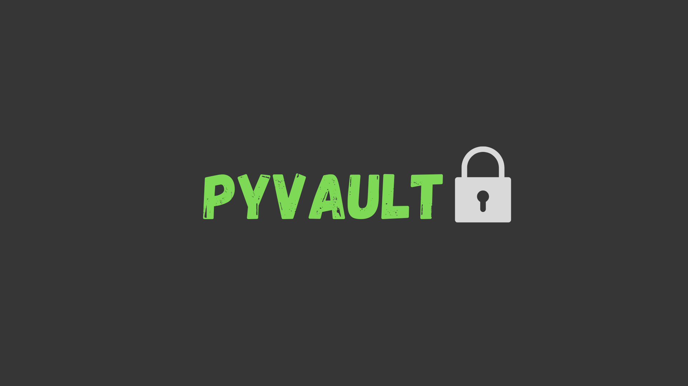



pyVault es un proyecto semestral para la materia de criptografía en donde porponemos un password vault como proyecto final. 

Autores: Alanis Millan, Anthony De Los Santos, Kevin Batista, Daneth Serracín yBlas Batista


Instalar dependencias:

```
pip install -r requirements.txt
```

Ejecutar:

```
python main.py
```
